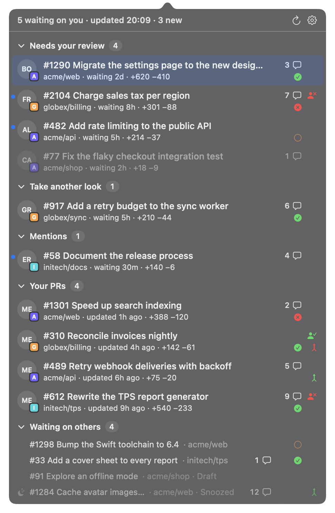
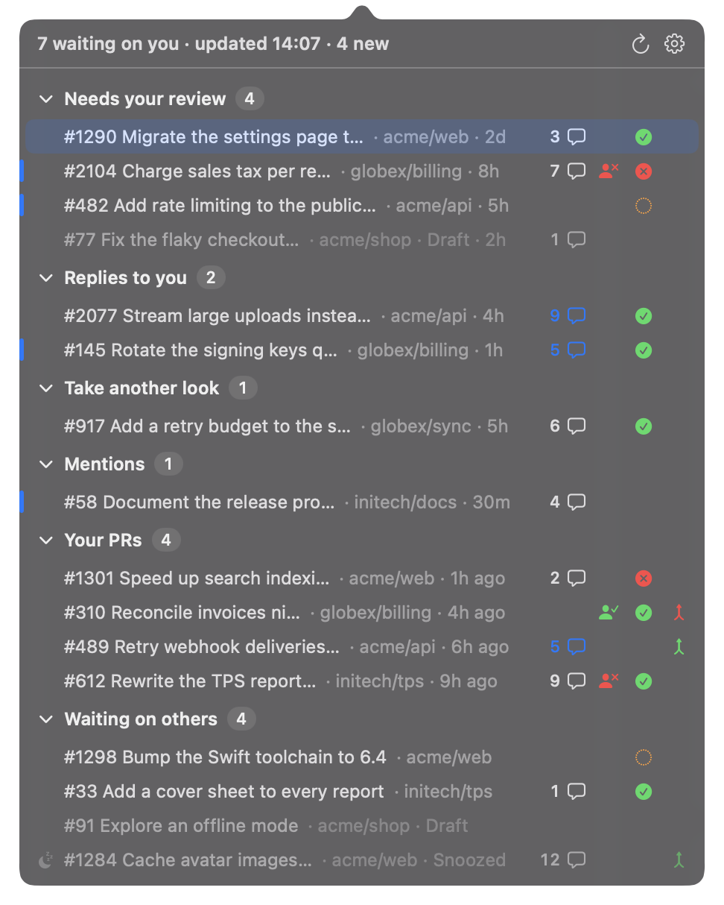

<p align="center">
  
</p>

<h1 align="center">PRInbox</h1>

<p align="center">
  A macOS menu-bar inbox for the pull requests waiting on you, signed in through the GitHub CLI.
</p>

<p align="center">
  <a href="https://github.com/creeonix/prinbox/actions/workflows/ci.yml"></a>
  <a href="https://github.com/creeonix/prinbox/releases/latest"></a>
  
  <a href="LICENSE"></a>
</p>

<p align="center">
  
</p>

## Why

Review requests get lost in email and GitHub notifications. PRInbox keeps one number in your menu bar,
the PRs waiting on you, and one click shows what they are and how long they have waited.

PRInbox is an open-source take on [Pullover](https://github.com/omgovich/pullover), with one difference:
it has **no OAuth app of its own**. Every request goes through `gh api graphql`, so PRInbox sees exactly
what your [GitHub CLI](https://cli.github.com) login sees. That includes organizations that block
third-party OAuth apps but have approved the GitHub CLI. PRInbox never reads, stores or sends your token.

## Features

- **A count in the menu bar.** It is dimmed when nothing waits on you and red when gh needs attention.
- **Six sections**, each foldable, with the fold state remembered:
  - **Needs your review:** you or one of your teams was asked, and you have not reviewed yet.
  - **Replies to you:** someone answered in a review thread you took part in, and the next word is yours.
    Found even on PRs where you are no longer a requested reviewer.
  - **Take another look:** your review was requested again after you already reviewed.
  - **Mentions:** someone mentioned you on their PR.
  - **Your PRs:** yours that need you: changes requested, merge conflicts, review threads you have not
    answered, CI is red, or approved and ready to merge.
  - **Waiting on others:** the rest of yours, one quiet line each, plus anything you snoozed.
- **Rows that answer "what, where and how long":** author avatar (with the organization's avatar in its
  corner when your inbox spans more than one organization), `org/repo` (same condition), time waiting (counted from when
  your review was requested), and lines added and removed.
- **Status at a glance:** four marks at the right edge of each row: comment count, review state
  (approved or changes requested), CI (passed, failed, running) and merge state (ready to merge or
  conflicts). Hover a mark for its meaning. On Replies to you rows and on your PRs with open threads, the
  comment bubble and its count turn blue; hover it for how many threads wait for you.
- **Group by organization** (off by default): each section groups its rows under a thin separator with
  the organization's color, name and count.
- **Snooze:** `S` (or right-click) parks a PR until something changes on it. It moves to Waiting on others,
  leaves the count, and comes back by itself when someone replies in a thread that concerns you, pushes a
  commit, requests your review again or (on your PRs) submits a review; your own activity keeps it
  parked. `U` brings it back sooner. Snoozes are kept in
  `~/Library/Application Support/prinbox/state.json`.
- **New since your last look:** rows that appeared or changed since you last closed the popover carry an accent
  bar at their left edge, and the header counts them.
- **Notifications** (off by default): one banner per refresh when new review requests or replies arrive; a newer
  banner replaces the previous unread one. Clicking it opens the PR (or the popover, when several arrived
  at once).
- **Compact rows** (off by default): every section as one-line rows, with the waiting time.
- **Follow review threads** (on by default): reads who commented in review threads and reviews, and when,
  for Replies to you, open threads and the snooze wake above. Off makes every refresh lighter and a snooze
  wakes on any change.
- **Keyboard first:** ↑/↓, Enter to open, S to snooze, U to unsnooze, R to refresh, Esc to close, and a
  global shortcut (⌃⌥P by default).
- **A real menu-bar popover:** tiling window managers such as OmniWM, AeroSpace and yabai leave it alone.
- **Clear setup help:** when gh is missing or signed out, the popover shows the exact commands, and
  PRInbox recovers by itself once they are done.
- **Stays fresh:** refreshes every 5 minutes, after wake and when opened; it keeps the last data while
  offline, and archived repositories are excluded.
  A refresh finds out first whether anything changed at all; when nothing did, it costs GitHub one
  request.
- **Launch at login**, from Settings in the popover.
- **Update notice:** once a day PRInbox asks GitHub (through gh) for its latest release. When a newer one
  exists, a line in the popover, a Download item in the icon's menu and a small badge on the icon link to
  it. Dev builds never check.

## Install

1. Install the GitHub CLI and sign in:

   ```sh
   brew install gh
   gh auth login
   ```

2. Download `PRInbox-<version>.dmg` from the
   [latest release](https://github.com/creeonix/prinbox/releases/latest), open it and drag
   **PRInbox** to **Applications**.
3. Open PRInbox. Releases are signed ad hoc rather than with an Apple Developer ID, so macOS blocks the
   first launch. Right-click PRInbox in Applications and choose **Open**, or go to
   **System Settings › Privacy & Security** and click **Open Anyway**. This is needed once.

Requires macOS 14 or later, on Apple silicon or Intel.

To build from source instead, see [Build from source](#build-from-source).

## Usage

### The menu-bar icon

| Icon | Meaning |
|---|---|
| pull-request symbol + number | PRs waiting on you: Needs your review, Take another look and Mentions (drafts not counted) |
| dimmed symbol | nothing is waiting on you |
| red symbol + `!` | gh is missing, signed out, offline or rate limited; hover for the reason |

When GitHub itself is having trouble (an HTTP 502 and friends), the warning line says so, keeps the last
data and links to the [GitHub status page](https://www.githubstatus.com).

Left-click opens the popover. Right-click offers Refresh now and Quit.

### Keyboard

| Key | Action |
|---|---|
| ↑ / ↓ | move the selection (wraps) |
| Enter | open the selected PR in your browser, or fold/unfold a section header |
| S | snooze the selected PR until it changes |
| U | unsnooze the selected PR |
| R | refresh now |
| Esc | close the popover, or leave Settings |
| ⌃⌥P | open the popover from anywhere (change it in Settings) |

Right-click a row for Open on GitHub, Snooze until it changes (or Unsnooze) and Copy link.

The global shortcut uses Carbon hot keys and needs no Accessibility permission. macOS lets apps share a
shortcut silently: Pullover also defaults to ⌃⌥P, so if you run both, give one of them another shortcut.

### When gh is missing or signed out

The popover replaces the list with setup steps, each command with a Copy button:

- **gh not installed:** `brew install gh`, then `gh auth login`.
- **gh not signed in, or its sign-in expired:** `gh auth login` (choose GitHub.com, then "Login with a
  web browser"). If your organization uses single sign-on, authorize gh for it when asked.

PRInbox checks again every 10 seconds, so it recovers by itself shortly after you finish.

If gh lives somewhere unusual, point PRInbox at it:

```sh
defaults write io.github.creeonix.prinbox ghPath /path/to/gh
```

When this override is set, PRInbox uses only that path. Remove it with
`defaults delete io.github.creeonix.prinbox ghPath`.

### Settings

Open Settings with the gear in the popover. It holds the global shortcut, launch at login, **Group by
organization**, **Show organization avatars**, **Compact rows**, **Follow review threads**, **Notify about new review requests and
replies**, the detected `gh` path, the version and Quit. Turning notifications on asks macOS for permission once; if you
decline, Settings says where to turn them on. Settings stay inside the popover, so there is never a window
for a tiling window manager to grab.

<p align="center">
  
</p>

### Command line

```sh
/Applications/PRInbox.app/Contents/MacOS/Prinbox --print   # print your inbox once (snoozed PRs show as such)
/Applications/PRInbox.app/Contents/MacOS/Prinbox --demo    # run with sample data
```

## Privacy and security

- **No token handling:** GitHub access goes only through `gh api graphql`. PRInbox has no OAuth app,
  and never reads, stores or sends a token.
- **Nothing leaves your Mac:** there is no telemetry and no server. The only network traffic is gh's
  GitHub API calls (the pull requests waiting on you in two steps, an ids-only search and the details in
  small batches, every five minutes or when something changed; the latest PRInbox release once a day) and avatar
  downloads from `avatars.githubusercontent.com` (authors and repository owners).
- **Local data:** avatars are cached in `~/Library/Caches/io.github.creeonix.prinbox`. Settings live in
  the app's user defaults. Snoozes and the "seen" ledger live in
  `~/Library/Application Support/prinbox/state.json`, a small JSON file keyed by PR id; `make uninstall`
  removes all three. [docs/state-file.md](docs/state-file.md) describes `state.json`.
- **What it reads:** PRInbox reads who commented in review threads and who reviewed, and when. It never
  fetches, stores or logs the text of a comment, a review or a description.

## Build from source

Requirements:
- macOS 14+
- Command Line Tools (`xcode-select --install`). Xcode also works but is not needed.
- `jq`, only for recording test fixtures.

```sh
git clone https://github.com/creeonix/prinbox.git && cd prinbox
make install      # builds, signs ad hoc, copies to /Applications and launches
make uninstall    # removes the app, its login item, caches and preferences
```

Other targets:

| Target | What it does |
|---|---|
| `make test` | runs the Swift Testing suite |
| `make lint` | runs swift-format lint, plus a check for `@State`/`#Preview` |
| `make coverage` | runs the tests with coverage; fails below 80% for PrinboxCore |
| `make run` | runs the app from the build directory |
| `make dmg VERSION=x.y.z` | builds the release DMG into `build/` |
| `make icon` | rebuilds the app icon from `Resources/AppIcon-source.png` |

## Development

- **Code layout:**
  - `Sources/PrinboxCore` holds all the logic (gh access, classification, formatting, state) and is
    unit tested. It has no AppKit.
  - `Sources/Prinbox` is the thin AppKit and SwiftUI shell.
- **Fixtures:** `scripts/record-fixture.sh <name>` records the live inbox as a two-phase fixture (the search and the detail
  batches). It
  rebuilds the response from an allowlist of fields and replaces repositories, logins, titles, URLs and
  ids with placeholders, and a test checks every string in every fixture.
- **State file:** [docs/state-file.md](docs/state-file.md) is the contract for
  `~/Library/Application Support/prinbox/state.json`.
- **UI checks:** things the tests cannot cover are listed in
  [docs/manual-checklist.md](docs/manual-checklist.md).
- **Releases:** see [RELEASING.md](RELEASING.md).
- **Building with Command Line Tools only**, which lack a few things Xcode provides:
  - SwiftUI's macro plugins, so `@State` and `#Preview` do not compile; view state lives in
    `@Observable` models instead.
  - XCTest, so the tests use Swift Testing.
  - A reliably found swift-testing macro plugin; `make test` passes its path explicitly.

## Roadmap

- Stacked PR chains.
- An MCP server, so AI agents can read your review queue.

## Credits

- [Pullover](https://github.com/omgovich/pullover) by Vlad Shilov: the idea, and the classification
  rules PRInbox ports.
- [omarchy-pullover](https://github.com/igor-alexandrov/omarchy-pullover) by Igor Alexandrov: the
  approach of signing in through the GitHub CLI.

See [THIRD_PARTY_NOTICES.md](THIRD_PARTY_NOTICES.md).

## License

MIT. See [LICENSE](LICENSE).
